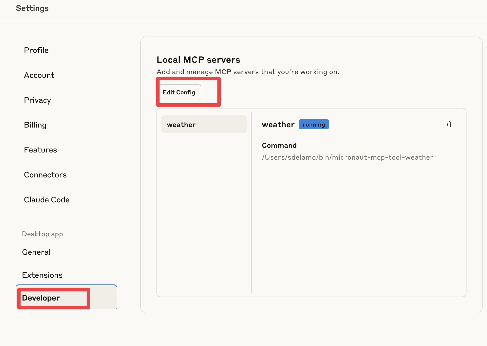
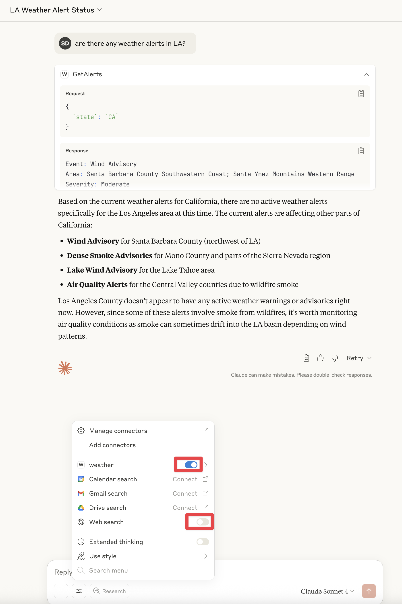

# Micronaut MCP Server Demo

[MCP Server Demo to expose weather alerts as shown in the Model Context Protocol documentation](https://modelcontextprotocol.io/docs/develop/build-server) built with Micronaut.

`stdio` branch for STDIO Transport.
`http` branch for HTTP Transport.

For `stdio`,  the [releases](https://github.com/sdelamo/micronaut-mcp-tools-weather/releases) contain [GraalVM](https://graalmv.org) Native Images of the MCP Server. You can download it and use it on your computer.

## Claude Configuration



The configuration could look like:

```json
{
  "mcpServers": {
      "weather": {
          "command": "$HOME/bin/micronaut-mcp-tool-weather",
          "args": []
      }
  }
}
```

After downloading, ensure you can run the native image on your OS. For example, for macOS, you need to tell the OS that you want to [open an app that hasn't been notarized or is from an unidentified developer](https://support.apple.com/en-us/102445If).

The easiest way to test the execution is to turn off the web search.

